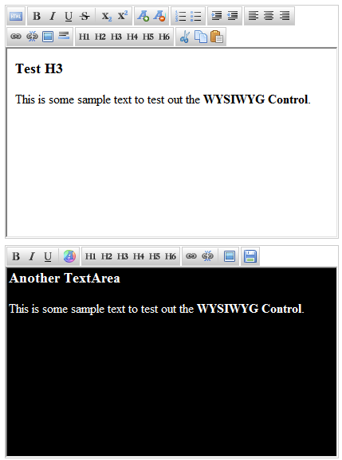
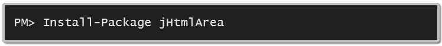

# jHtmlArea

A simple, light weight, extensible WYSIWYG HTML Editor built on top of jQuery. This component allows you to easily display a WYSIWYG HTML Editor in place of any TextArea DOM Elements on the page. The minified script alone is 10.3kb; CSS and Images it's a total of approx. 26kb.

[View Documentation Here](https://github.com/crpietschmann/jHtmlArea/wiki)

## Key Advantages of jHtmlArea

- Free, open source (MIT License)

- Simple and Lightweight - ~10kb minified - ~26kb w/ css and images

- Supports all mainstream browsers - Chrome, Edge, Firefox, Safari

- Built on top of jQuery (requires jQuery 1.3.2 or higher)

- Full Documentation

## Screenshots



## Basic Usage

```
$(function(){
    $("textarea").htmlarea();
});
```

## jDelivr CDN

Pull in from jsdelivr CDN:

```
<!-- jHtmlArea Compontent -->
<link rel="stylesheet" href="https://cdn.jsdelivr.net/gh/crpietschmann/jHtmlArea@v1.0.0/dist/css/jHtmlArea.css">
<script src="https://cdn.jsdelivr.net/gh/crpietschmann/jHtmlArea@1.0.0/dist/js/jHtmlArea.js"></script>

<!-- jHtmlArea Color Picker Menu -->
<link rel="stylesheet" href="https://cdn.jsdelivr.net/gh/crpietschmann/jHtmlArea@v1.0.0/dist/css/jHtmlArea.ColorPickerMenu.css">
<script src="https://cdn.jsdelivr.net/gh/crpietschmann/jHtmlArea@1.0.0/dist/js/jHtmlArea.ColorPickerMenu.js"></script>
```

The minified links for the CDN:

```
<!-- jHtmlArea Compontent -->
<link rel="stylesheet" href="https://cdn.jsdelivr.net/gh/crpietschmann/jHtmlArea@v1.0.0/dist/css/jHtmlArea.css">
<script src="https://cdn.jsdelivr.net/gh/crpietschmann/jHtmlArea@1.0.0/dist/js/jHtmlArea.min.js"></script>

<!-- jHtmlArea Color Picker Menu -->
<link rel="stylesheet" href="https://cdn.jsdelivr.net/gh/crpietschmann/jHtmlArea@v1.0.0/dist/css/jHtmlArea.ColorPickerMenu.css">
<script src="https://cdn.jsdelivr.net/gh/crpietschmann/jHtmlArea@1.0.0/dist/js/jHtmlArea.ColorPickerMenu.min.js"></script>
```

## NuGet Package

[http://nuget.org/packages/jHtmlArea](http://nuget.org/packages/jHtmlArea)



## Tutorials / Articles

[jHtmlArea - The all NEW HTML WYSIWYG Editor for jQuery](https://pietschsoft.com/post/2009/07/21/jhtmlarea-the-all-new-html-wysiwyg-editor-for-jquery)

[Adding Custom Toolbar Buttons](https://pietschsoft.com/post/2009/08/18/jhtmlarea-adding-custom-toolbar-buttons)

## Icons

This project also includes icons from the Silk Icon Set by Mark James. You can download the Silk Icon Set here:

[http://www.famfamfam.com/lab/icons/silk/](http://www.famfamfam.com/lab/icons/silk/)
